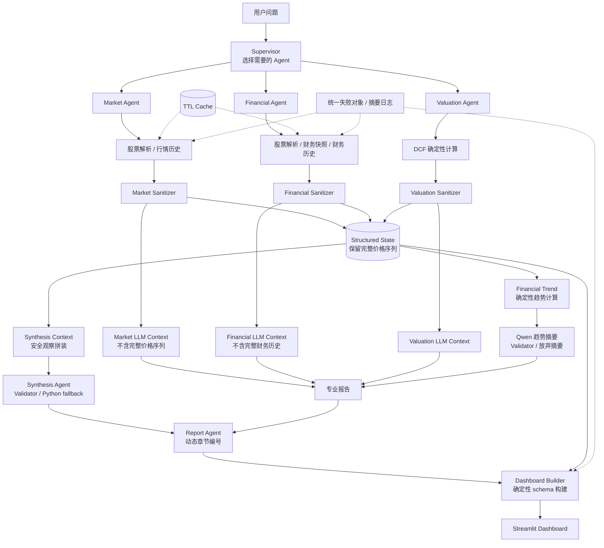

# A 股多智能体分析系统

这是一个面向 A 股分析的多智能体应用。系统把用户问题拆给市场、财务、估值三个专业 Agent，再由综合层和报告层生成 Dashboard 数据，最后通过 Streamlit 展示。

项目当前重点不是给出投资建议，而是演示一条可控的金融分析链路：外部数据进入结构化状态，LLM 只看到经过裁剪和校验的安全上下文，DCF 估值由 Python 确定性计算完成。

## 核心能力

- 市场分析：解析 A 股股票名称或代码，获取近 60 个交易日行情，计算收益率、均价位置、波动率、最大回撤和成交量相对均量。
- 财务分析：获取最新财务指标，并为 Dashboard 补充最近 12 期历史财务序列。
- 财务趋势：用确定性 Python 逻辑计算同比趋势，再让 Qwen 生成摘要；摘要不合规时自动放弃。
- DCF 估值：只基于用户提供的自由现金流、增长率、折现率、永续增长率和预测年数进行确定性计算。
- 综合分析：只基于各 Agent 输出后的安全观察做跨模块综合；未通过校验时使用 Python fallback。
- Dashboard：展示 market / financial / valuation / synthesis / final_report，并支持局部失败降级。
- 缓存与降级：AkShare / 网络数据有内存 TTL 缓存，外部失败会返回统一失败对象，不拖垮整条链路。

## 架构图



## 安全边界

系统刻意区分两类数据：

- Structured State：应用内部和 Dashboard 使用，允许保留完整价格序列、完整财务历史、DCF 预测序列。
- LLM Context：发送给 Qwen 的上下文，只包含裁剪后的安全字段和 Python 生成的客观描述。

关键约束：

- Market Agent 不把完整 60 日价格序列发给 Qwen。
- Financial Agent 不把完整 12 期财务历史发给 Qwen。
- Valuation Agent 不自行估算自由现金流，DCF 必须由工具确定性计算。
- Synthesis 不重新计算工具结果，只能基于安全观察综合。
- Validator 发现越界模块、新数字或不合规趋势表达时，使用 fallback 或放弃摘要。

## 本地运行

### 1. 安装依赖

项目使用 Poetry：

```bash
poetry install
```

如果不用 Poetry，也可以按 `pyproject.toml` 安装依赖。当前项目直接使用 `langchain.tools.tool`，因此需要安装 `langchain`、`langchain-openai`、`langgraph`、`akshare` 和 `streamlit`。

### 2. 配置环境变量

复制环境变量模板：

Linux / macOS：

```bash
cp .env.example .env
```

Windows PowerShell：

```powershell
Copy-Item .env.example .env
```

然后填写 DashScope API Key：

```env
DASHSCOPE_API_KEY="your-dashscope-api-key"
```

### 3. 启动 Dashboard

```bash
poetry run streamlit run app/dashboard/streamlit_app.py --server.port 8502
```

浏览器打开：

```text
http://127.0.0.1:8502
```

健康检查：

```text
http://127.0.0.1:8502/healthz
```

## 演示案例

Dashboard 首屏：


推荐使用下面这个完整三 Agent 问题：

```text
请综合分析贵州茅台的市场表现和最新财务指标，并以自由现金流1亿元、增长率5%、折现率10%、永续增长率2%、预测5年进行DCF估值。
```

预期链路：

```text
用户问题
→ Supervisor 选择 market / financial / valuation
→ Market 获取股票代码与近 60 日行情
→ Financial 获取最新财务指标，并补充最近 12 期历史
→ Financial Trend 计算同比趋势
→ Valuation 执行 5 年 DCF
→ Synthesis 生成综合分析或 Python fallback
→ Report Agent 生成动态编号最终报告
→ Dashboard Builder 输出 dashboard_data
→ Streamlit 展示结果
```

一次成功运行通常会看到：

- `market.price_series`：60 条
- `financial.history_series`：12 期
- `valuation.dcf.forecast_series`：5 年
- `synthesis.report`：存在
- `final_report`：存在

也可以直接运行完整链路冒烟测试：

```bash
poetry run python -m app.multi_agent
```

更多演示材料：

- [演示手册](docs/DEMO_GUIDE.md)
- [答辩讲稿](docs/PRESENTATION_SCRIPT.md)
- [项目总结](docs/PROJECT_SUMMARY.md)
- [发布前检查清单](docs/RELEASE_CHECKLIST.md)

## 其他测试入口

```bash
poetry run python -m compileall app
poetry run python -m app.test_financial_trend
poetry run python -m app.dashboard.builder
```

这些入口只输出摘要，不会打印完整价格序列或完整财务历史。

## Docker

构建镜像：

```bash
docker build -t financial-agent-dashboard .
```

启动容器：

```bash
docker run --env-file .env -p 8502:8502 financial-agent-dashboard
```

然后打开：

```text
http://127.0.0.1:8502
```

## 目录说明

```text
app/
  agents/            专业 Agent、Supervisor、综合和报告生成
  analytics/         确定性趋势计算与综合上下文构建
  dashboard/         Dashboard schema builder 与 Streamlit 渲染
  formatters/        确定性报告格式化
  sanitizers/        工具结果清洗与 LLM 安全视图
  runtime.py         统一失败对象、缓存、摘要日志
  debug_helpers.py   本地测试和冒烟验证输出 helper
  multi_agent.py     主多智能体图
  tools.py           AkShare 数据工具与 DCF 工具
```

## 免责声明

本项目仅用于学习、研究和系统演示，不构成投资建议。市场和财务数据可能受数据源、网络、交易日和接口口径影响，使用前请自行核验。
