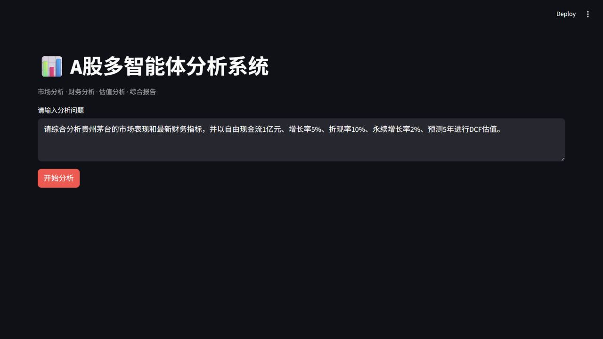

# 演示手册

本文档用于课堂展示、项目答辩或录屏演示。目标是用一条固定问题展示系统的完整链路，并用一个降级案例说明安全边界。

## 演示前检查

1. 确认 `.env` 中已配置：

```env
DASHSCOPE_API_KEY="your-dashscope-api-key"
```

2. 确认依赖已安装：

```bash
poetry install
```

3. 运行基础检查：

```bash
poetry run python -m compileall app
poetry run python -m app.test_financial_trend
poetry run python -m app.dashboard.builder
```

4. 启动 Dashboard：

```bash
poetry run streamlit run app/dashboard/streamlit_app.py --server.port 8502
```

5. 打开页面：

```text
http://127.0.0.1:8502
```

健康检查地址：

```text
http://127.0.0.1:8502/healthz
```

## 主演示问题

Dashboard 首屏截图：



```text
请综合分析贵州茅台的市场表现和最新财务指标，并以自由现金流1亿元、增长率5%、折现率10%、永续增长率2%、预测5年进行DCF估值。
```

## 演示讲解顺序

1. 打开 Dashboard，先说明这是一个 A 股多智能体分析系统。
2. 展示默认问题，指出它同时包含市场、财务和 DCF 估值请求。
3. 点击“开始分析”。
4. 观察后台摘要日志：
   - Supervisor 选择 `market / financial / valuation`。
   - Market 获取股票解析和近 60 日行情。
   - Financial 获取最新财务指标，并补充 12 期历史财务数据。
   - Financial Trend 执行确定性同比趋势计算。
   - Valuation 调用 DCF 工具生成 5 年预测。
   - Synthesis 基于安全观察生成综合分析，必要时使用 Python fallback。
   - Dashboard Builder 生成稳定 schema。
5. 回到页面展示四个区域：
   - 市场表现
   - 财务指标与历史趋势
   - DCF 估值
   - 综合分析与最终汇总报告

## 预期验收点

一次成功演示通常应满足：

- `market.price_series` 为 60 条。
- `financial.history_series` 为 12 期。
- `valuation.dcf.forecast_series` 为 5 年。
- `synthesis.report` 存在。
- `final_report` 存在。
- 页面健康检查返回 `ok`。

## 安全边界讲解

演示时重点说明：

- 完整行情序列保留在 Structured State，用于 Dashboard 画图。
- Market LLM Context 不包含完整价格序列。
- 完整财务历史保留在 Structured State，用于 Dashboard 和趋势引擎。
- Financial LLM Context 不包含完整 12 期财务历史。
- DCF 只使用用户给定参数，由 Python 工具确定性计算。
- Synthesis 不重新计算任何工具结果，只基于安全观察做综合。
- Qwen 输出如果出现越界模块、新数字或不合规趋势表达，会触发 fallback 或放弃摘要。

## 异常降级演示

可选演示目标：说明系统不会因为某个外部源或模型失败而整页崩溃。

建议讲法：

1. 先说明外部依赖包括 AkShare 网络接口和 Qwen 模型接口。
2. 说明工具层失败会返回统一失败对象：

```text
状态=失败
数据可用=False
来源=<失败来源>
错误信息=<摘要错误>
可重试=True/False
```

3. 说明 Dashboard Builder 支持局部失败：
   - 某个模块失败时，该模块显示失败提示。
   - 其他模块继续展示。
   - `errors` 字段保留失败摘要。

4. 说明模型输出失败或不合规时：
   - Financial Trend Qwen 摘要可被放弃，但确定性趋势保留。
   - Synthesis 可切换到 Python fallback。
   - Report 和 Dashboard 仍可使用已有结构化数据继续生成。

## 录屏建议

录屏可以控制在 3 到 5 分钟：

1. 20 秒：介绍系统目标。
2. 40 秒：展示架构图和安全边界。
3. 90 秒：运行主演示问题。
4. 60 秒：讲 Dashboard 四个区块。
5. 40 秒：讲 fallback 和异常降级。
6. 30 秒：总结项目价值和下一步。
